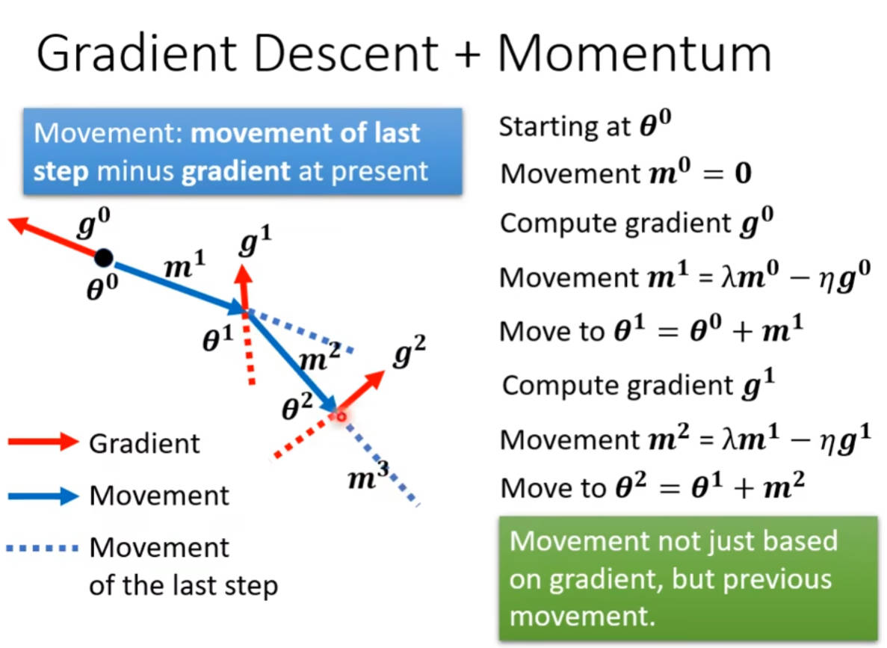

### Machine Learning  
- Looking for a function  

### Types of Functions  
1. Regression: The function outputs a scalar.  
2. Classification: one-hot vector + softmax + cross-entropy  
3. Structure Learning(creative)  

### Loss function(Gradient descend)  
- MAE, MSE  
- To minimize the Loss  
- $L=\frac{1}{N} \sum_{i=0}^nE$
    - $g=\nabla L(w_0)$
    - $w_1 = w_0 - \eta\times g$
- Regularization: Make function smoother  
- Error computing  
    - Mean Square Error  
        - $e = \sum_{i=0}(\hat{y_i}-y_{i})^2$
    - Cross-entropy  
        - $e=-\sum_{i=0}\hat{y_i}lny_i$

### Activation Functions  
> A function can be approximately expressed with a set of piecewise functions.  

> Piecewise function can be approximately simulated with sigmoid functions.  

#### Sigmoid Function  
- $y = b + \sum_{i}c_isigmoid(b_i+\sum_jw_{ij}x_j)$
- Provide the ability to simulate any function  

#### Rectified Linear Unit(ReLU) Function  
> Two relu compose a hard sigmoid function.  
- $y = b + \sum_{2i}c_imax(0,b_i+\sum_jw_{ij}x_j)$

  

#### Find suitable function with the selected features  
  

#### Sum of series of Sigmoid function to achieve the truth function    

#### Softmax  

### Gradient Descent

#### True Power -- Chain Rule  

## General Guide  

### Overfitting  
> Solutions  

- less parameters, sharing parameters  
- less features  
- early stop  
- regularization  
- dropout  

### Optimization  
> Find a theta to get the lowest Loss  
> SGD: Stochastic gradient descent & SGDM: SGD with Momentum  
> Issues: Critical point makes gradient zero: local minima, local maximum and saddle point.  

#### Batch Size  
> For an iteration, the train data set with specific size is considered for parameter updating.  
$\theta = \theta - \eta\times\frac{1}{N}\sum_{i}^N$

> For batch size=1, the update is too noisy.  

> Relatively, Small batch size performs better than large batch size.  

#### Momentum  

#### Adaptive learning rate  
1. Adagrad: Root Mean Square  
      
2. RMSProp:  
      
3. Adam: RMSProp + Momentum  
4. Learning Rate Decay & Warm up(up then down)  
      
5. AdamW  

#### Feature Normalization  
> BatchNorm  

## Network architectures  

### CNN  
- Base on three observation  
    1. For image recognization, only parts of the picture holds the features. -- Filter  
    2. Patterns can be in different place. -- Convoluntion  
    3. Subsampling usually not impacts the pattern-detecting. -- Pooling  
- Filter has the shape (channels of input, kernel_size_tuple) and outputs a scaler(Summation of products of all channels)  

      

### Spatial Transformer Layer  
> CNN is not invariant to scaling and rotation  
>> So data augmentation is needed.  

### Self-attention  
1. To learn $W_k , W_q ,  W_v$  
2. Multi-head self-attention is widely used  
3. Truncated self-attention  
4. CNN: self-attention that can only attends in a receptive field.  

### Graph Network work  

### Unsupervised Learning -- word embedding  

### Transformer  
> Seq2seq  

1. Encoder  

2. Decoder -- Autoregressive  

### Generative Adversarial Network  

### Self-supervised Learning  

> A contextualized word embedding.    

1. Bert -- A pre-trained model 

### Auto-Encoder  
> Feature disentangle  

### Anomaly Detection  
> Detect the input with different distribution from training dataset.      

### Unsupervised Learning  

### Explainable Machine Learning  
1. Local explaination
    1. Saliency Map   
    2. Smooth Gradient  
2. Global explaination  

### Aversarial Attack  

### Domain Adaptation  

### Reinforcement Learning 
1. Policy Gradient  

### Compression for network  

