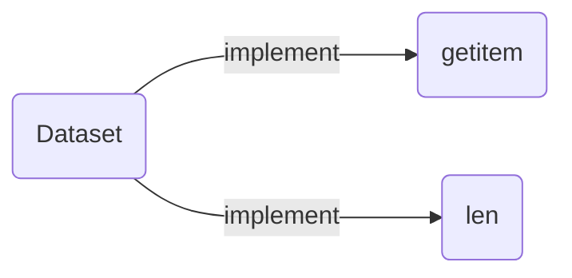

### Install Pytorch  
- [Home Page](https://pytorch.org/)  

#### Install Conda  
- [Github Page](https://github.com/conda/conda)  
- Select your version from the Distribution [page](https://repo.anaconda.com/archive/).  

```shell
wget https://repo.anaconda.com/archive/Anaconda3-2024.10-1-Linux-x86_64.sh
chmod +x Anaconda3-2024.10-1-Linux-x86_64.sh
./Anaconda3-2024.10-1-Linux-x86_64.sh
```

#### Basic Usage of Conda  
```shell
conda info
conda create --name ENV_NAME python=3.12.7
conda activate ENV_NAME
conda deactivate
conda env list
conda env remove --name ENV_NAME

# update conda
conda update -n base conda
```

#### Install Pytorch Via Conda  
```shell
# Copied from the official website
conda install pytorch torchvision torchaudio pytorch-cuda=12.4 -c pytorch -c nvidia

# Check whether installed
python -c "import torch; print(torch.cuda.is_available())"
python -c "import torch; print(torch.__version__)"
python -c "import torch; print(torch.version.cuda)"
```

### Dataset & DataLoader  


#### Implement your Dataset  
```python
from torch.utils.data import Dataset
from PIL import Image
import os

class MyDataset(Dataset):
    def __init__(self, data_dir, label_dir):
        # Prefix of the absolute path
        data_dir = data_dir if data_dir.endswith('/') else data_dir + '/'
        label_dir = label_dir if label_dir.endswith('/') else label_dir + '/'
        # All items in the specific directory and concat them with the Prefix
        self.data_items = [data_dir + item for item in os.listdir(data_dir)]
        self.label_items = [label_dir + item for item in os.listdir(label_dir)]
    def __getitem__(self, index):
        item_data = Image.open(data_items[index])
        item_label = SomethingHere
        return item_data, item_label
    def __len__(self):
        return len(self.data_items)
```

### Tensor Type  
```python
import torch

# scalar
a = torch.tensor(1.)
print(a.shape)
print(a.size())
print(a.type())

# one dimension with the specified value
# Receive the specific value list
a = torch.tensor([1.])

# one dimension with two elements with 3 elements, Uninitialized
# Receive the dimension
a = torch.FloatTensor(2,3)

# 4 dimension in which:
# one dimension holds 3 elements
# the second dimension holds two elements of one dimension
# the third dimension holds three elements of two dimension
# the fourth dimension holds two elements of three dimension
a = torch.rand(2,3,2,3)
# For example, a batch of image is:
batch = torch.rand(batch_size,channel_size,img_height,img_width)

# The element numbers in this Tensor
num = a.numel()
```

#### To Tensor
```python
a = np.array([2,3.3])
# The data type will be kept
b = torch.from_numpy(a)

# from list
a = [2,3.,9,4]
a = torch.tensor(a)
```

#### Index Tensor  
```python
a = torch.rand(4,3,4)
# [3,4]
a[0].shape
#[4]
a[0,0].shape
# A scalar
a[0,0,0] = 1
# [2,1,4]
a[:2,-1:,:].shape
# [2,1,2] with step
a[:2,-1:,::2].shape
```

#### Reshape Tensor  
```python
a=torch.rand(4,1,28,28)
a.view(4,28*28)
a.view(4,28,28)
```

#### Concat and Split Tensor  
```python
a1 = torch.rand(4,3,32,32)
a2 = torch.rand(5,3,32,32)
# [9,3,32,32]
torch.cat([a1,a2],dim=0).shape

a2 = torch.rand(4,3,32,32)
#[2,4,3,32,32]
torch.stack([a1,a2],dim=0).shape
```


### TensorBoard  

#### Install TensorBoard  
```shell
conda install -y -c conda-forge tensorboard
```

#### Basic usage of TensorBoard  
- [Official Docs](https://pytorch.org/docs/stable/tensorboard.html)  
- Add tensorboard to your project.  
```python
from torch.utils.tensorboard import SummaryWriter
writer = SummaryWriter("dirname")

# In train
for i in range(epoch):
    loss_temp = 0.0
    for data in myloader:
        imgs, targets = data
        if torch.cuda.is_available():
            imgs = imgs.cuda()
            targets = targets.cuda()
        outputs = network(imgs)
        loss = loss_fn(outputs,targets)
        optimizer.zero_grad()
        loss.backward()
        optimizer.step()
        loss_temp = loss.item()
    # A 
    writer.add_scalar('loss/train',loss_temp,i)
    writer.flush()
    print(f"epoch is {i}, loss is {loss_temp}")
writer.close()
```
> Run TensorBoard and then access it via web gui  
```shell
tensorboard --logdir=[dirname] --port=6000 --bindall
```

### Transforms  
- Transforms are common image transformations  
- Transform datas into Tensor  
```python

```


